<div align="center">

# Rydr

**基于 Spring Cloud 的微服务网约车平台**

[](https://www.oracle.com/java/)
[](https://spring.io/projects/spring-boot)
[](https://spring.io/projects/spring-cloud)
[](LICENSE)
[](CONTRIBUTING.md)

[架构](#架构) | [快速开始](#快速开始) | [模块说明](#模块说明) | [文档](docs/) | [贡献指南](CONTRIBUTING.md)

</div>

---

## 目录

- [项目简介](#项目简介)
- [架构](#架构)
- [模块说明](#模块说明)
- [技术栈](#技术栈)
- [环境要求](#环境要求)
- [快速开始](#快速开始)
- [服务端口](#服务端口)
- [项目结构](#项目结构)
- [时序图](#时序图)
- [演示截图](#演示截图)
- [安全说明](#安全说明)
- [贡献指南](#贡献指南)
- [许可证](#许可证)

## 项目简介

Rydr 是一个基于 **Spring Cloud 微服务架构** 的网约车平台**教学/演示项目**，用于演示企业级微服务的构建方式与技术选型。

> **重要说明（现状）**：本项目当前是**教学/演示项目，非生产就绪系统**。已实现并可运行的业务链路包括：
> - **登录/验证码链路**：`api-passenger`/`api-driver` → `service-verification-code`（验证码生成/校验，Redis 缓存 120s）→ `service-sms`（短信下发）→ `service-passenger-user`（乘客登录建号）→ JWT 签发。
> - **计价链路**：`api-passenger`/`api-driver` → `service-valuation`（`/forecast/single` 基于 Haversine 的预估计价；另有基于规则库 `RuleCache`/`PriceCache` 的分段计价 `ValuationService`）。
> - **订单/派单/监听链路**：`service-order`（抢单，分布式锁）→ `service-order-dispatch`（Redis 派单）→ `api-listen-order`（SSE 流式推送司机）。
> - **异步消息**：`service-jms-produce` → `service-jms-consumer`（ActiveMQ 队列/主题）。
>
> **尚未实现（桩/空壳/演示占位）**：
> - `service-wallet`：仅启动类，**无任何钱包业务**（充值/支付/余额/流水全无）。
> - 司机用户服务、收入统计：代码中无对应实现。
> - `api-passenger`/`api-driver` 的 `OrderServiceImpl.forecast`：空桩（`return null`）。
> - `service-sms` 短信发送：默认 `ConsoleSmsSender`（仅打印日志，未接真实短信服务商）。
> - 各模块 `TestController`/`GatewayTestController`/`StudyService` 等演示接口仍保留。
>
> 将本项目从演示项目升级为**完全可用业务项目**的完整改造计划，见 `.codebuddy/plans/补全不完整业务-实施计划.md`。

## 架构

系统采用 **三层微服务架构**：

```
┌──────────────────────────────────────────────────────────────┐
│       API 网关（Spring Cloud Gateway :9100）                  │
├──────────────┬───────────────┬───────────────────────────────┤
│ api-passenger│   api-driver  │      api-listen-order         │  ← API 层
│    :9011     │  :9002-9003   │          :8084                │
├──────────────┴───────────────┴───────────────────────────────┤
│  service-order  │ service-sms │ service-valuation │ ...      │  ← 服务层
│    :8004-8005   │  :8002-8003 │    :8060-8061     │          │
├──────────────────────────────────────────────────────────────┤
│  Eureka :7900 │ Config :6001 │ Admin :6010 │                 │  ← 基础设施层
└──────────────────────────────────────────────────────────────┘
         │              │              │              │
    ┌────┴────┐    ┌────┴────┐   ┌────┴────┐   ┌────┴────┐
    │  MySQL  │    │  Redis  │   │RabbitMQ │   │ActiveMQ │
    └─────────┘    └─────────┘   └─────────┘   └─────────┘
```

### 通信方式

| 模式 | 技术 | 使用场景 |
|---------|-----------|----------|
| 声明式 HTTP | OpenFeign（circuitbreaker/fallback） | api-passenger → service-valuation |
| 负载均衡 HTTP | RestTemplate + LoadBalancer | api-driver → service-sms |
| 服务发现 | Netflix Eureka | 所有服务注册与发现 |
| 异步消息 | ActiveMQ（JMS） | 后台任务处理 |
| 配置刷新 | RabbitMQ（Spring Cloud Bus） | 动态配置更新 |

## 模块说明

### API 层（面向客户端）

| 模块 | 工程名 | 端口 | 说明 |
|--------|-------------|------|-------------|
| 乘客 API | `api-passenger` | 9011 | 乘客端接口（认证、短信、订单预估价） |
| 司机 API | `api-driver` | 9002-9003 | 司机端接口（抢单、短信） |
| 订单监听 | `api-listen-order` | 8084 | 基于 Redis 的订单派单 SSE 流式推送 |

### 服务层（业务逻辑）

| 模块 | 工程名 | 端口 | 说明 |
|--------|-------------|------|-------------|
| 订单服务 | `service-order` | 8004-8005 | 抢单与分布式锁（5 种锁实现，教学对比） |
| 派单服务 | `service-order-dispatch` | 8006 | 基于 Redis 的司机-订单派单 |
| 乘客服务 | `service-passenger-user` | 8012 | 乘客登录建号（地址/资料接口为桩） |
| 短信服务 | `service-sms` | 8002-8003 | 短信通知下发（默认 console 桩） |
| 计价服务 | `service-valuation` | 8060-8061 | 预估计价 + 规则库分段计价 |
| 验证码服务 | `service-verification-code` | 8011 | 登录验证码生成/校验 |
| 钱包服务 | `service-wallet` | 8007 | 空壳（仅启动类，无业务） |

### 基础设施层

| 模块 | 工程名 | 端口 | 说明 |
|--------|-------------|------|-------------|
| 注册中心 | `eureka` | 7900 | Netflix Eureka |
| 配置中心 | `rydr-config-server` | 6001 | 集中化配置 |
| API 网关 | `rydr-zuul` | 9100 | Spring Cloud Gateway 路由与过滤 |
| 服务监控 | `cloud-admin` | 6010 | Spring Boot Admin |

### 共享库

| 模块 | 工程名 | 说明 |
|--------|-------------|-------------|
| 公共模块 | `rydr-common` | DTO、常量、JWT 工具、校验、切面 |

## 技术栈

| 分类 | 技术 |
|----------|-----------|
| **框架** | Spring Boot 3.5.16 + Spring Cloud 2025.0.3（JDK 17） |
| **服务发现** | Netflix Eureka |
| **API 网关** | Spring Cloud Gateway |
| **负载均衡** | Spring Cloud LoadBalancer |
| **熔断降级** | OpenFeign circuitbreaker/fallback |
| **服务间调用** | OpenFeign |
| **数据库** | MySQL 5.7+，HikariCP 连接池 |
| **ORM** | MyBatis（mybatis-spring-boot 3.0.5） |
| **缓存/分布式锁** | Redis（支持哨兵模式）+ Redisson 3.46.0 |
| **消息中间件** | ActiveMQ（JMS） |
| **配置管理** | Spring Cloud Config + RabbitMQ Bus |
| **认证** | JWT（JJWT 0.13.0） |
| **监控** | Spring Boot Admin 3.5.0 |
| **构建工具** | Maven 3.x |

## 环境要求

- **Java** 17+
- **Maven** 3.6+
- **MySQL** 5.7+（驱动 `com.mysql.cj.jdbc.Driver`）
- **Redis** 4.0+（支持哨兵模式）
- ActiveMQ *(可选，用于 JMS 特性)*
- RabbitMQ *(可选，用于配置总线)*

## 快速开始

### 1. 克隆仓库

```bash
git clone https://github.com/weiguangli-io/rydr.git
cd rydr
```

### 2. 配置环境变量

```bash
cp .env.example .env
# 按需修改 .env
```

关键变量：

| 变量 | 说明 | 默认值 |
|--------|------------|---------|
| `DB_HOST` | MySQL 主机 | `localhost` |
| `DB_PORT` | MySQL 端口 | `3306` |
| `DB_USER` | MySQL 用户名 | `root` |
| `DB_PASSWORD` | MySQL 密码 | `changeme` |
| `DB_NAME` | 业务库（订单/计价） | `rydr` |
| `DB_NAME_THREE` | 业务库（乘客/短信） | `rydr-three` |
| `REDIS_HOST` | Redis 主机 | `127.0.0.1` |
| `EUREKA_USER` | Eureka 认证用户名 | `admin` |
| `EUREKA_PASSWORD` | Eureka 认证密码 | `changeme` |
| `JWT_SECRET` | JWT 签名密钥 | *(需自行生成)* |

> 完整的可配置变量清单见 [`.env.example`](.env.example)。

### 3. 启动基础设施（Docker）

```bash
docker compose up -d
```

该命令会启动 MySQL（自动导入表结构）、Redis、ActiveMQ 和 RabbitMQ。详见 [`docker-compose.yml`](docker-compose.yml)。

> **不使用 Docker：** 手动安装各组件，然后执行 `mysql -u root -p < rydr-sql.sql` 导入表结构（共 108 张表）。

### 4. 按顺序启动服务

```bash
# 1. 注册中心
cd rydr/eureka && mvn spring-boot:run -Dspring.profiles.active=7900

# 2. 配置中心（可选）
cd rydr/rydr-config-server && mvn spring-boot:run

# 3. 业务服务
cd rydr/service-passenger-user && mvn spring-boot:run
cd rydr/service-sms && mvn spring-boot:run -Dspring.profiles.active=8002
cd rydr/service-verification-code && mvn spring-boot:run
cd rydr/service-order && mvn spring-boot:run -Dspring.profiles.active=8004
cd rydr/service-valuation && mvn spring-boot:run -Dspring.profiles.active=8060

# 4. API 层
cd rydr/api-passenger && mvn spring-boot:run
cd rydr/api-driver && mvn spring-boot:run -Dspring.profiles.active=9002

# 5. API 网关（Spring Cloud Gateway）
cd rydr/rydr-zuul && mvn spring-boot:run
```

### 服务端口

| 服务 | 端口 |
|---------|---------|
| Eureka 注册中心 | 7900 |
| 配置中心 | 6001 |
| 服务监控（Cloud Admin） | 6010 |
| API 网关（Spring Cloud Gateway） | 9100 |
| api-passenger | 9011 |
| api-driver | 9002, 9003 |
| api-listen-order | 8084 |
| service-passenger-user | 8012 |
| service-sms | 8002, 8003 |
| service-order | 8004, 8005 |
| service-valuation | 8060, 8061 |
| service-verification-code | 8011 |
| service-order-dispatch | 8006 |
| service-wallet | 8007 |
| 演示应用 | 8083 |

## 项目结构

```
rydr/                                # 仓库根目录
├── rydr/                            # Maven 父工程
│   ├── api-driver/                  # 司机 API
│   ├── api-listen-order/            # 订单监听 API
│   ├── api-passenger/               # 乘客 API
│   ├── cloud-admin/                 # Spring Boot Admin
│   ├── config-client/               # 配置中心客户端示例
│   ├── config-client-diy/           # 自定义配置中心客户端
│   ├── eureka/                      # Eureka 注册中心
│   ├── rydr-common/                 # 共享公共库
│   ├── rydr-config-server/          # 配置中心服务端
│   ├── rydr-demo-app/               # 演示应用
│   ├── rydr-zuul/                   # API 网关（Spring Cloud Gateway）
│   ├── service-jms-consumer/        # JMS 消费者示例
│   ├── service-jms-produce/         # JMS 生产者示例
│   ├── service-order/               # 订单服务
│   ├── service-order-dispatch/      # 派单服务
│   ├── service-passenger-user/      # 乘客服务
│   ├── service-sms/                 # 短信服务
│   ├── service-valuation/           # 计价服务
│   ├── service-verification-code/   # 验证码服务
│   └── service-wallet/              # 钱包服务
├── README/                          # 文档图片
├── docs/                            # 补充文档
├── rydr-sql.sql                     # 数据库表结构（108 张表）
├── .env.example                     # 环境变量模板
├── .gitignore                       # Git 忽略规则
├── CONTRIBUTING.md                  # 贡献指南
├── LICENSE                          # MIT 许可证
└── README.md                        # 本文件
```

## 时序图

<details>
<summary><strong>乘客登录与注册</strong></summary>

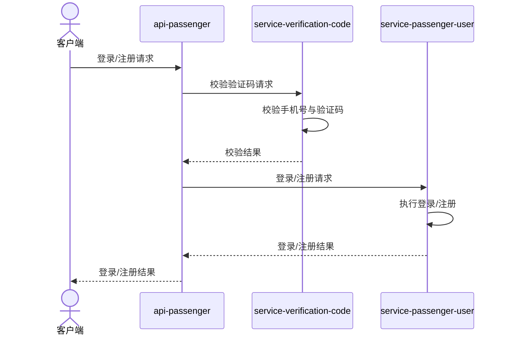

</details>

<details>
<summary><strong>验证码流程</strong></summary>

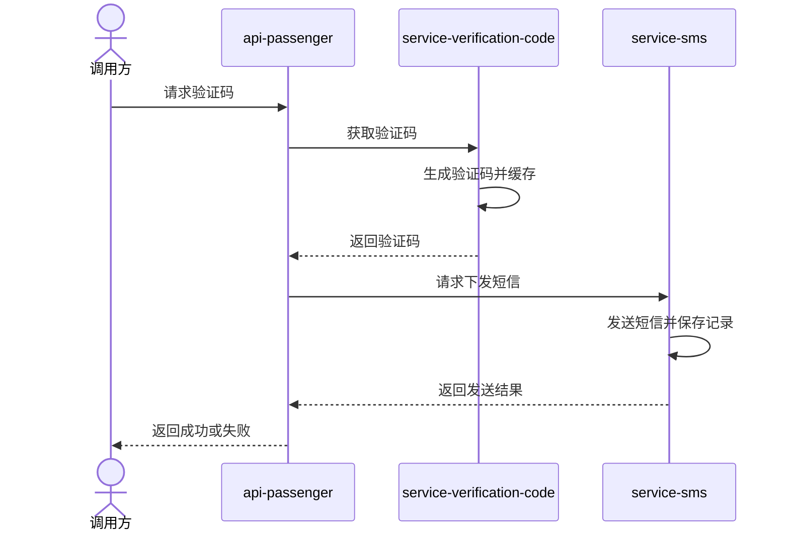

</details>

<details>
<summary><strong>司机工作流</strong></summary>

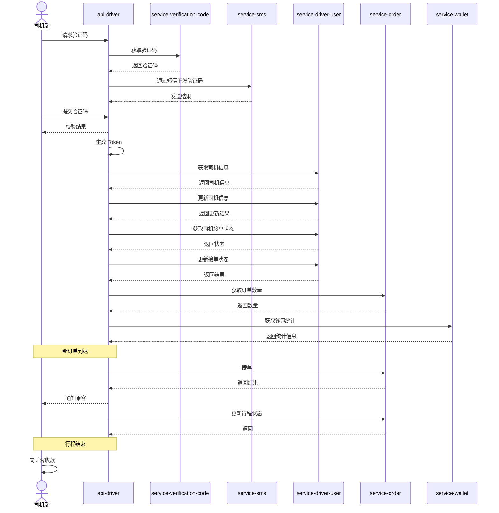

</details>

<details>
<summary><strong>乘客下单流程</strong></summary>

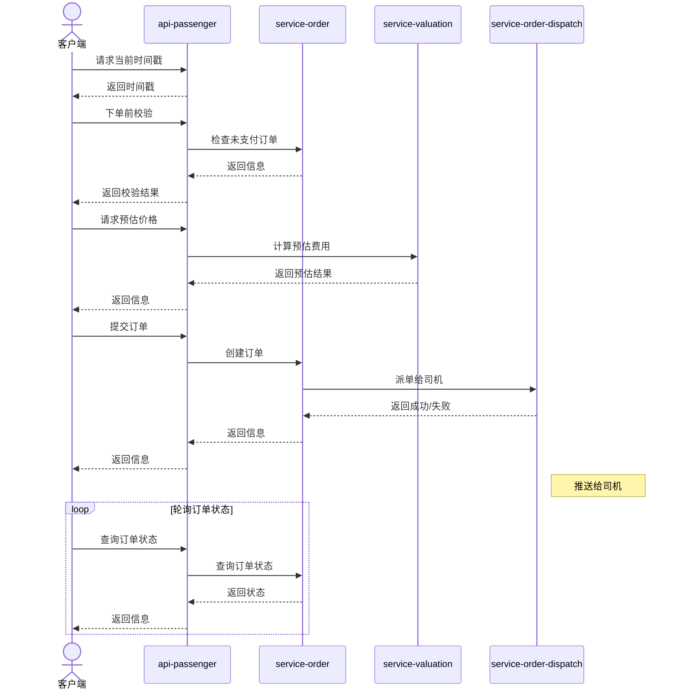

</details>

<details>
<summary><strong>资料更新</strong></summary>

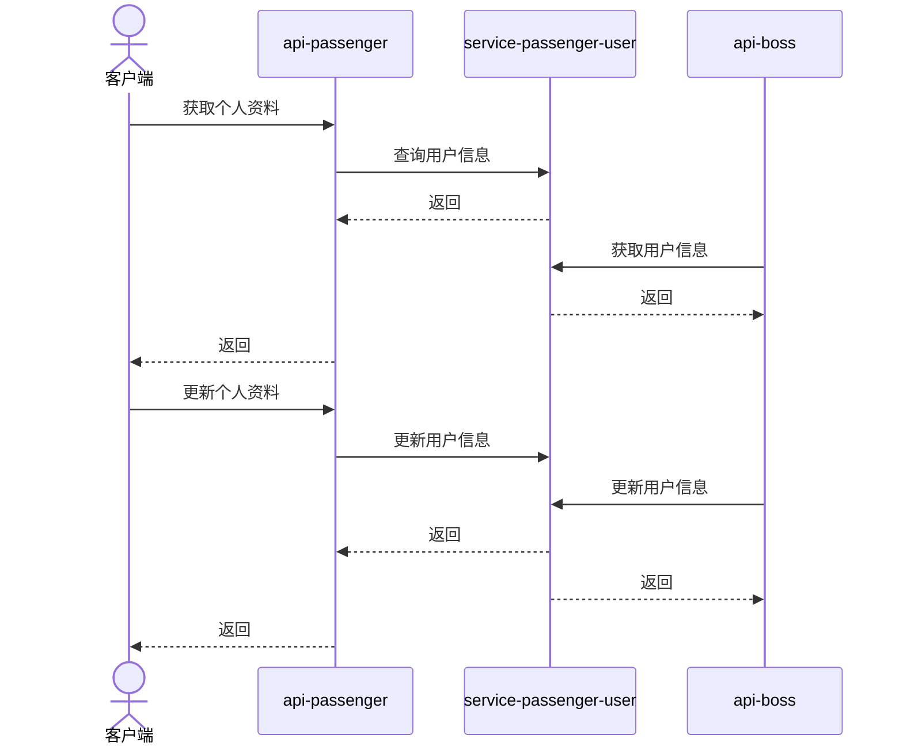

</details>

<details>
<summary><strong>地址管理</strong></summary>

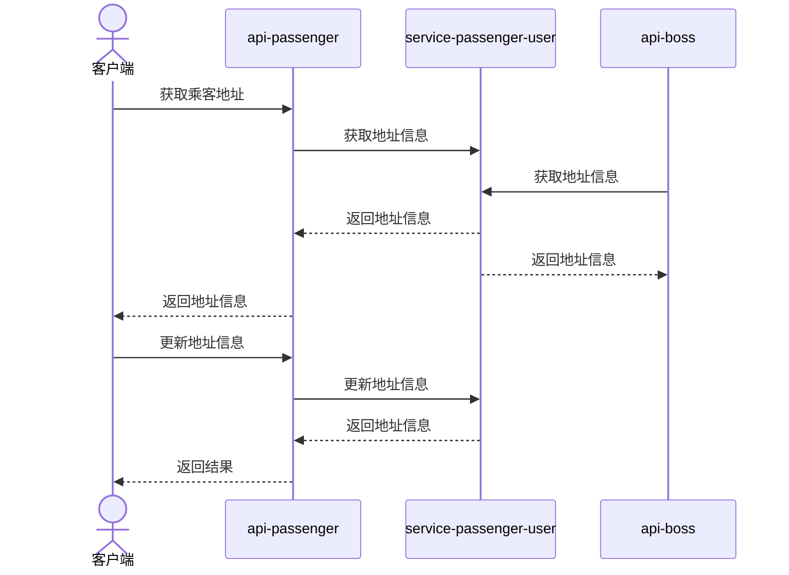

</details>

## 演示截图

<details>
<summary><strong>点击查看订单生命周期截图</strong></summary>

### 1. 派单与接单
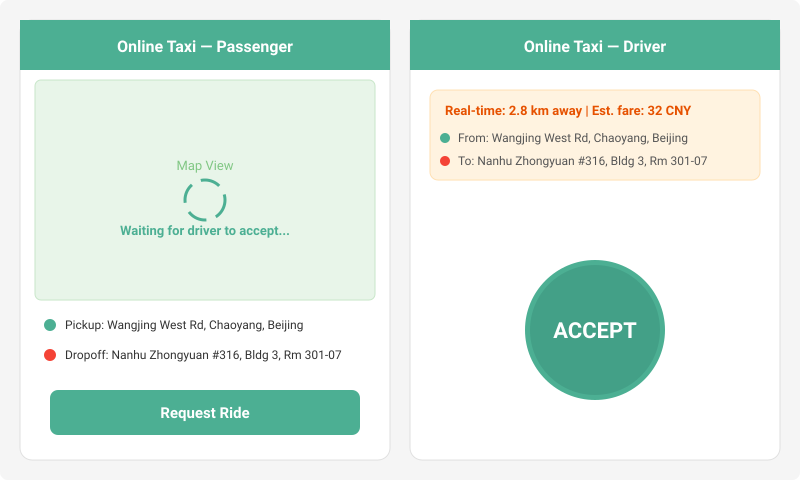

### 2. 到达上车点
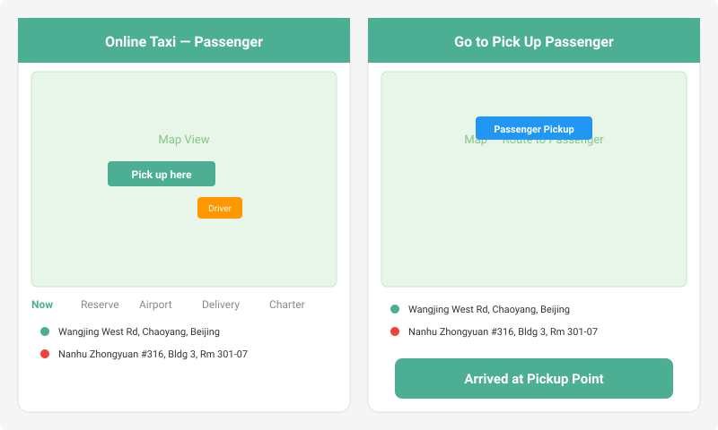

### 3. 乘客已上车
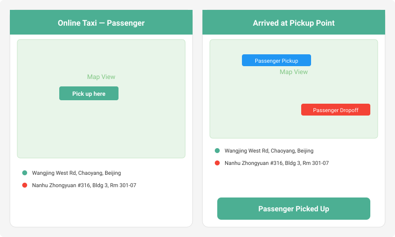

### 4. 行程开始
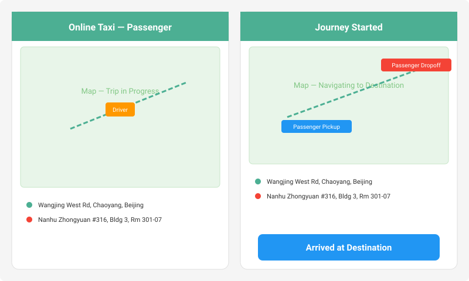

### 5. 到达目的地
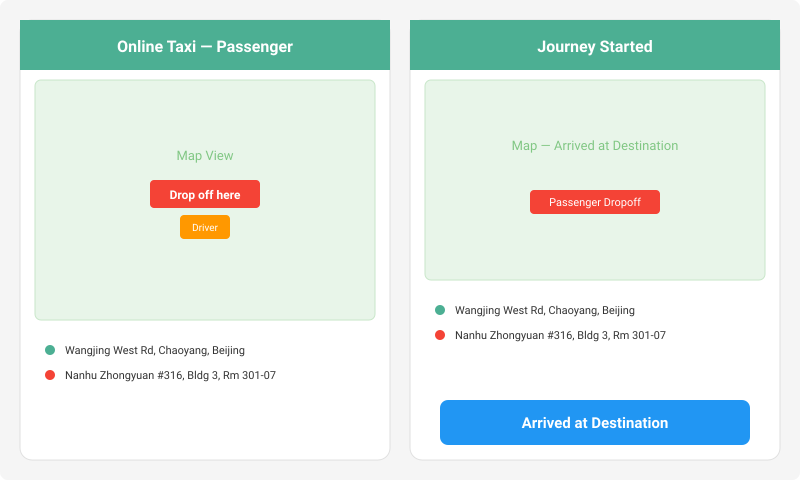

### 6. 发起支付
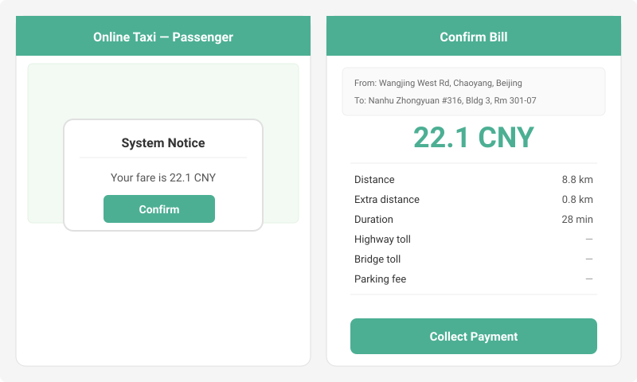

### 7. 收款完成
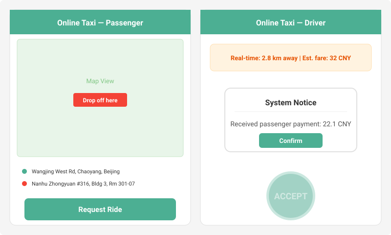

</details>

## 安全说明

- 所有敏感凭证均通过环境变量外部化配置
- 切勿提交 `.env` 文件或任何包含真实凭证的文件
- 生产环境中 JWT 密钥**必须**修改，不可使用默认值
- Eureka 端点已通过 HTTP Basic 认证保护
- 部署生产前请复核 `management.endpoints.web.exposure` 配置
- 完整的安全相关变量清单见 [`.env.example`](.env.example)

> **当前状态说明**：本项目仍为**教学/演示项目**。已完成一轮缺陷修复（登录码值统一、`checkCode` 补全、短信调用贯通、`ListenService` 真实 Redis 读取 + SSE、`AliServiceImpl` 模板缓存与发送抽象、JMS 队列名统一、`rydr-common` 切面条件化、RedissonClient 注入歧义、端口冲突、熔断优雅降级、RSA 私钥外置、异常处理器、测试类包名等）。
>
> **仍未实现、升级为可用业务项目需补齐的核心能力**（详见改造计划）：
> - `service-wallet`：空壳，无充值/支付/余额/流水。
> - 司机用户服务与收入统计：不存在。
> - `api-passenger`/`api-driver` 的 `OrderServiceImpl.forecast`：空桩。
> - 真实短信服务商接入（当前为 console 桩）。
> - 完整订单状态机、司机选择策略、位置上报、支付闭环、安全与可运维化。
>
> 完整改造计划见 `.codebuddy/plans/补全不完整业务-实施计划.md`。

## 贡献指南

欢迎贡献代码！提交 Pull Request 前请先阅读[贡献指南](CONTRIBUTING.md)。

## 许可证

本项目基于 [MIT 许可证](LICENSE) 开源。
